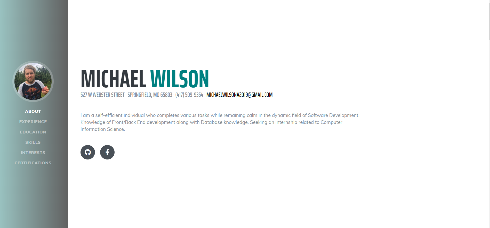

# Programming Survey Form - Window's Form's

This is a bootstrap template I found that I could mess around with.  This shows that I can go through a Web devlopment project and alter elements and learn concepts.

## Example Output

## Analysis Steps
Alter the template

	1)  Mess around with google dev tools and change the css of certain elements
	2)  Experiment with the functionallity
	3)  Change the color theme
	4)  change some of the font
	5)  Add in some bio about myself and change some of the icons
	6)  Add in my certifications and have them open in a new page on click.

## Notes

This is basically a learning experience about what I could use boot strap 4.  I'm hoping to actually make an online resume without having to use a framework.   

## Do not change content below this line
## Adapted from a README Built With

* [Dropwizard](http://www.dropwizard.io/1.0.2/docs/) - The web framework used
* [Maven](https://maven.apache.org/) - Dependency Management
* [ROME](https://rometools.github.io/rome/) - Used to generate RSS Feeds

## Contributing

Please read [CONTRIBUTING.md](https://gist.github.com/PurpleBooth/b24679402957c63ec426) for details on our code of conduct, and the process for submitting pull requests to us.

## Versioning

We use [SemVer](http://semver.org/) for versioning. For the versions available, see the [tags on this repository](https://github.com/your/project/tags). 

## Authors

* **Billie Thompson** - *Initial work* - [PurpleBooth](https://github.com/PurpleBooth)

See also the list of [contributors](https://github.com/your/project/contributors) who participated in this project.

## License

This project is licensed under the MIT License - see the [LICENSE.md](LICENSE.md) file for details

## Acknowledgments

* Hat tip to anyone who's code was used
* Inspiration
* etc
